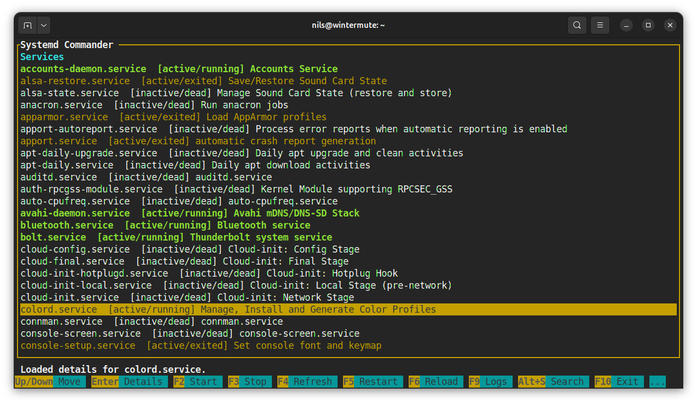
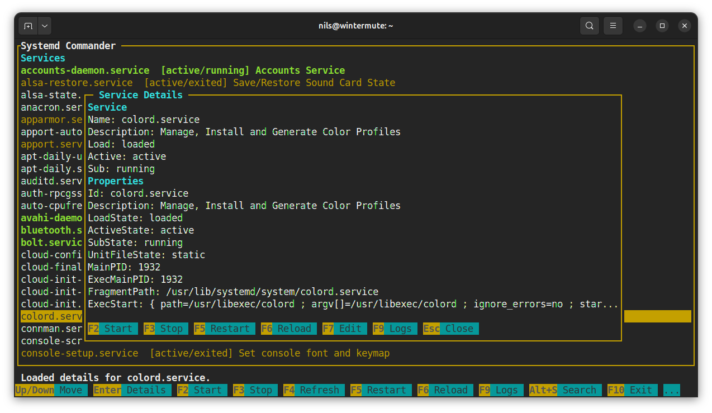
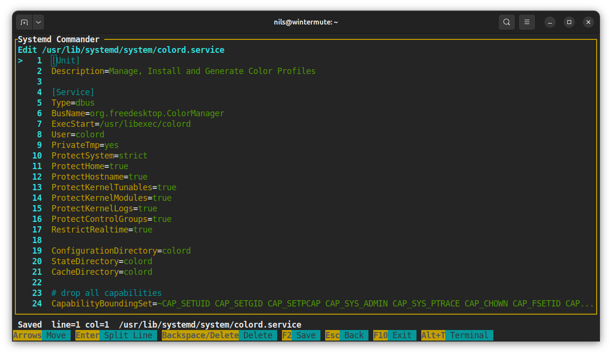
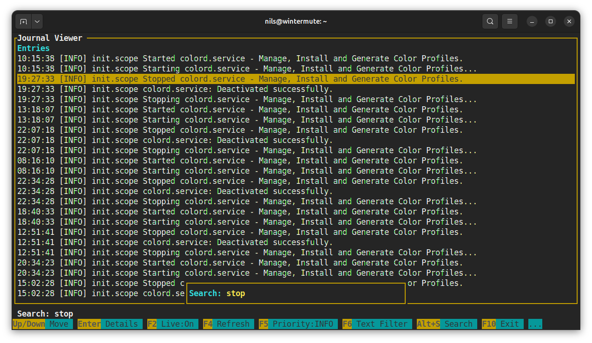
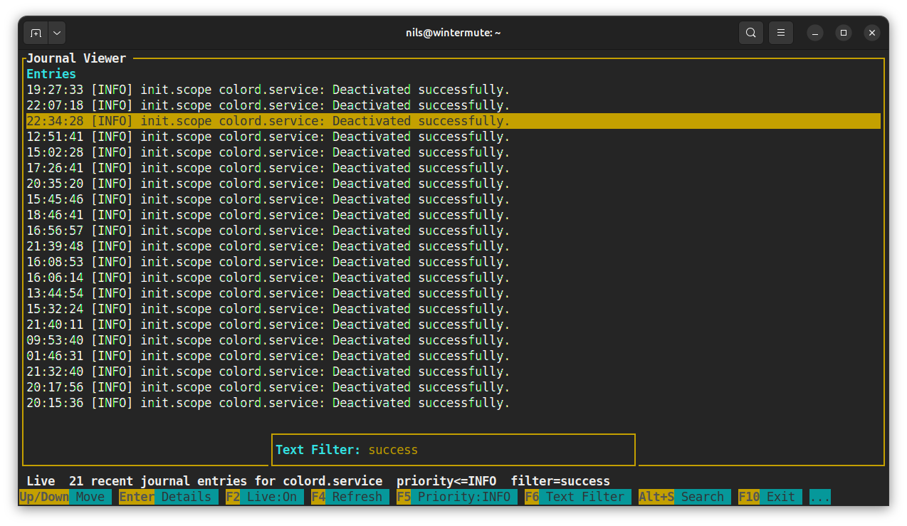
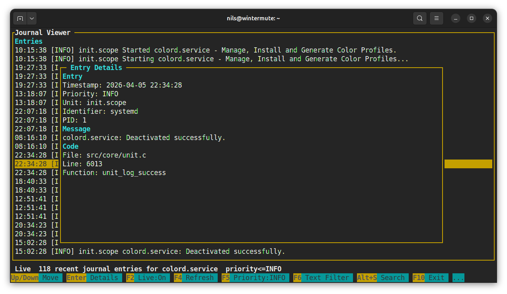

# systemd_commander

`systemd_commander` is a standalone terminal UI for `systemd` service management and `journalctl` log browsing. It was extracted from [`ros2_console_tools`](https://github.com/nilseuropa/ros2_console_tools) and keeps the same shared ncurses TUI, but builds as a plain CMake project with no ROS 2 dependencies.

## Included Tools

- `systemd_commander`: browse service units, inspect details, start/stop/restart/reload units, edit unit files, and jump into logs
- `journal_viewer`: browse journal entries with live refresh, priority filtering, text filtering, and detail popups

## Screenshots

### systemd_commander







### journal_viewer







## Build

Requirements:

- CMake 3.16+
- a C++17 compiler
- `ncursesw`
- optional: GTest for the parser tests

Build locally:

```bash
cmake -S . -B build
cmake --build build -j
```

Run tests:

```bash
ctest --test-dir build --output-on-failure
```

Install:

```bash
cmake --install build
```

## Usage

Launch the tools directly from the build tree:

```bash
./build/systemd_commander
./build/journal_viewer
```

Optional unit preselection:

```bash
./build/systemd_commander --unit ssh.service
./build/journal_viewer --unit ssh.service
./build/journal_viewer --namespace robot
```

## Interaction Model

Common keys:

- `F10`: exit
- `Enter`: inspect or open the selected item
- `Esc`: close the current popup or return
- `F4`: refresh
- `Alt+S`: incremental search
- `Alt+T`: toggle the embedded terminal pane

Tool-specific highlights:

- `systemd_commander`: `F2` start, `F3` stop, `F5` restart, `F6` reload, `F7` edit unit file, `F9` open logs
- `journal_viewer`: `F2` toggle live/snapshot mode, `F5` cycle priority filter, `F6` text filter, `F7` namespace

## Theme Configuration

The default theme file is installed to:

```text
share/systemd_commander/config/tui_theme.yaml
```

At runtime the theme lookup order is:

1. `SYSTEMD_COMMANDER_THEME_PATH`
2. installed `share/systemd_commander/config/tui_theme.yaml`
3. source tree fallback at `config/tui_theme.yaml`

## Notes

- The tools rely on local `systemctl` and `journalctl`.
- Privileged operations are requested on demand instead of requiring the whole UI to run as `root`.
- `systemd_commander` opens `journal_viewer` in embedded mode for the selected unit on `F9`;
  if the unit exposes `LogNamespace`, that namespace is applied automatically.
