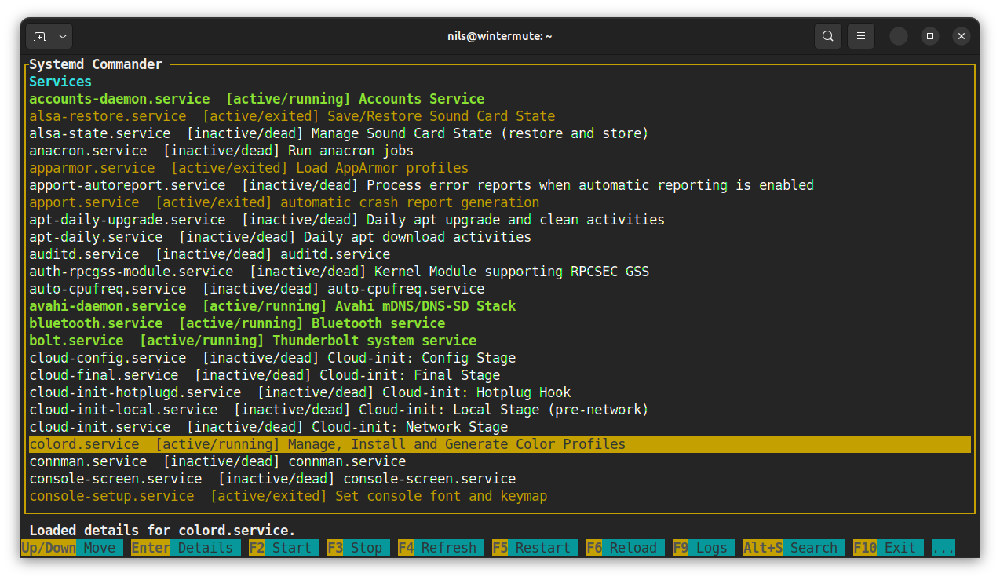
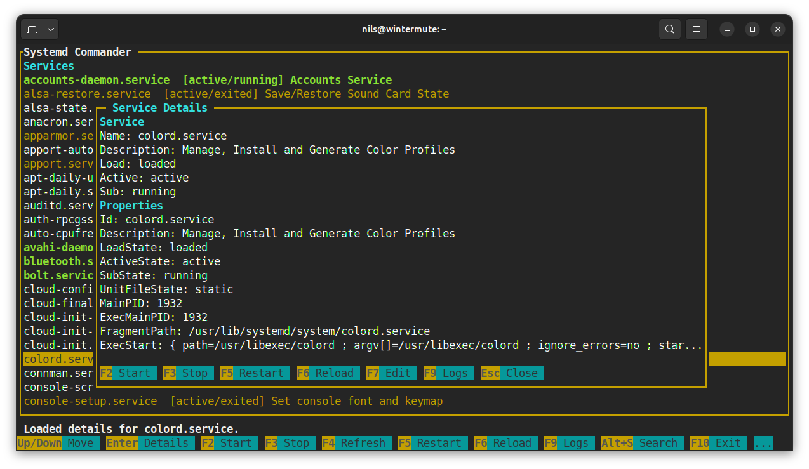
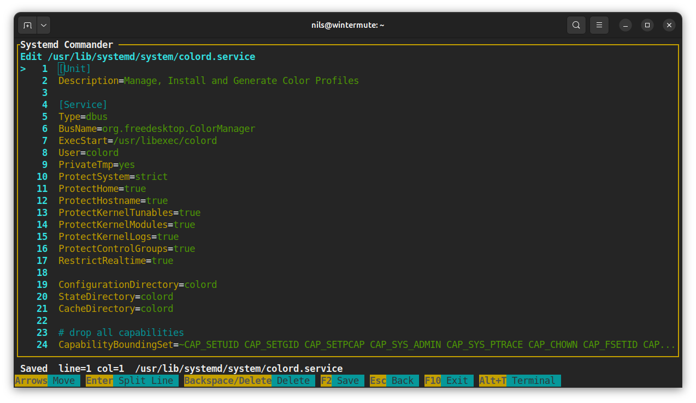
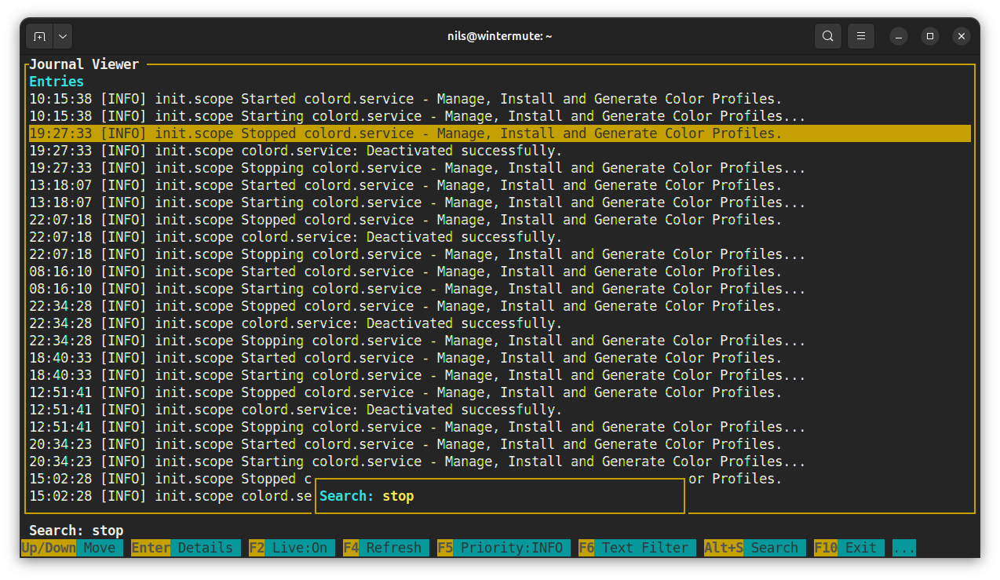
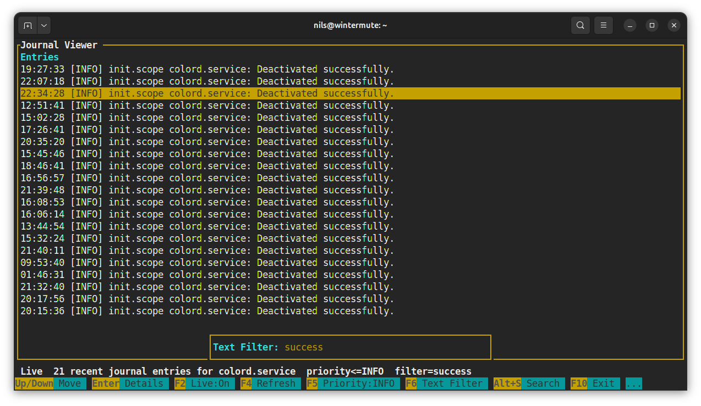
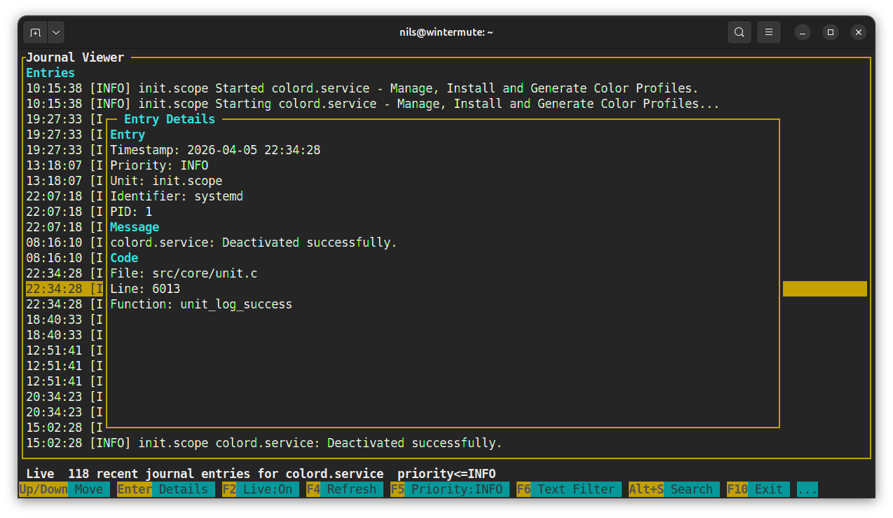

# systemd_commander

`systemd_commander` is a standalone terminal UI for `systemd` service management and `journalctl` log browsing. It was extracted from [`ros2_console_tools`](https://github.com/nilseuropa/ros2_console_tools) and keeps the same shared ncurses TUI, but builds as a plain CMake project with no ROS 2 dependencies.

## Included Tools

- `systemd_commander`: browse loaded and installed service units, inspect details, start/stop/restart/reload units, enable/disable unit files, edit unit files, and jump into logs
- `journal_viewer`: browse journal entries with live refresh, priority filtering, text filtering, namespace selection, and detail popups

## Screenshots

### systemd_commander







### journal_viewer







## Build

Requirements:

- CMake 3.16+
- a C++17 compiler
- `ncursesw`
- optional: GTest for the parser tests

Build locally:

```bash
cmake -S . -B build
cmake --build build -j
```

Run tests:

```bash
ctest --test-dir build --output-on-failure
```

Install:

```bash
cmake --install build
```

## Usage

Launch the tools directly from the build tree:

```bash
./build/systemd_commander
./build/journal_viewer
./build/systemd_commander --version
./build/journal_viewer --version
```

Optional filters:

```bash
./build/systemd_commander --unit ssh.service
./build/journal_viewer --unit ssh.service
./build/journal_viewer --namespace robot
```

## Interaction Model

Common keys:

- `F1`: help
- `F10`: exit
- `Enter`: inspect or open the selected item
- `Esc`: close the current popup or return
- `Home` / `End`: jump to the first or last item
- `Alt+S`: incremental search
- `Alt+T`: toggle the embedded terminal pane

`systemd_commander` service list:

- `F2`: start selected service
- `F3`: stop selected service
- `F4`: refresh service list
- `F5`: restart selected service
- `F6`: reload selected service
- `F7`: enable selected service
- `F8`: disable selected service
- `F9`: open logs for selected service

`systemd_commander` service details:

- `F2`: start selected service
- `F3`: stop selected service
- `F4`: edit the selected unit file
- `F5`: restart selected service
- `F6`: reload selected service
- `F9`: open logs for selected service

`systemd_commander` service editor:

- `F2`: save changes
- `Esc`: return to the previous view

`journal_viewer`:

- `F2`: toggle live/snapshot mode
- `F4`: refresh entries
- `F5`: cycle priority filter
- `F6`: edit text filter
- `F7`: namespace picker

The journal namespace picker includes the default namespace, `*` for all namespaces, and
namespaces discovered from `systemd-journald@*.service`. Press `E` in the picker to enter
a namespace manually.

## Service Discovery

`systemd_commander` starts by loading runtime service state with `systemctl list-units`.
After the UI is visible, it also loads installed service unit files with `systemctl list-unit-files`
in the background. That second pass adds disabled services to the list and fills in each unit's
`UnitFileState` without blocking startup.

Disabled services are shown with a separate theme color, while failed services still take priority
as errors. The service editor marks unsaved changes in the title/status text and changes the editor
frame to the `dirty` theme color until the file is saved.

## Theme Configuration

The default theme file is installed to:

```text
share/systemd_commander/config/tui_theme.yaml
```

At runtime the theme lookup order is:

1. `SYSTEMD_COMMANDER_THEME_PATH`
2. installed `share/systemd_commander/config/tui_theme.yaml`
3. source tree fallback at `config/tui_theme.yaml`

## Notes

- The tools rely on local `systemctl` and `journalctl`.
- Privileged operations are requested on demand instead of requiring the whole UI to run as `root`.
- `systemd_commander` opens `journal_viewer` in embedded mode for the selected unit on `F9`;
  if the unit exposes `LogNamespace`, that namespace is applied automatically.
- If a unit-filtered journal view has no entries in the default namespace, the status line suggests
  using `F7` or `*` to check other journal namespaces.

## License

Licensed under the Apache License, Version 2.0. See [`LICENSE`](LICENSE).

## Changelog

### v.1.3.0

- Added installed service discovery via `systemctl list-unit-files`, including disabled service units.
- Added `UnitFileState` display and service list search coverage for enablement states.
- Added list-context `F7` enable and `F8` disable actions with sudo fallback.
- Moved unit-file editing in Service Details to `F4`.
- Added a disabled-service theme color and dirty editor frame color handling.
- Trimmed the bottom help bar and refreshed the help menu to separate list and detail contexts.
